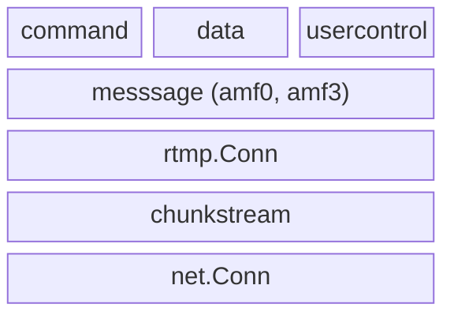

# rtmp-go

Go implementation of Enhanced RTMP, focused on maintaining low-level access to fundamental RTMP message structures

# Examples

Three trivial example programs are provided:

- **server** — An RTMP server that accepts connections on port 1935. When a client sends a publish command, the server logs the received media. When a client sends a play command, the server streams blank video and silent audio.
- **client-publish** — An RTMP client that connects to a server, publishes a stream, and sends blank media to a server.
- **client-play** — An RTMP client that connects to a server, sends a play command, and logs received media.

## Building

```sh
go build ./examples/server/
go build ./examples/client-publish/
go build ./examples/client-play/
```

## Usage

Each example can be paired with ffmpeg/ffplay or with the other examples. The examples listen on or connect to `localhost:1935`.

### Publishing to the server

The server logs media it receives from a publishing client.

#### With ffmpeg as the publish client

```sh
# Terminal 1: Start the RTMP server
./server

# Terminal 2: Publish a test stream to the server
ffmpeg -re -f lavfi -i testsrc=duration=60:size=1280x720:rate=30 \
  -f lavfi -i "sine=frequency=1000:duration=60" \
  -shortest -f flv rtmp://localhost/live
```

#### With client-publish as the publish client

```sh
# Terminal 1: Start the RTMP server
./server

# Terminal 2: Publish blank media to the server
./client-publish
```

### Playing from the server

The server sends blank video and silent audio to a playing client.

#### With ffplay as the play client

```sh
# Terminal 1: Start the RTMP server
./server

# Terminal 2: Play the stream from the server
ffplay rtmp://localhost/live
```

#### With client-play as the play client

```sh
# Terminal 1: Start the RTMP server
./server

# Terminal 2: Play the stream
./client-play
```

### Client-publish with ffplay as the server

Use ffplay in listen mode as a simple RTMP server, then publish to it:

```sh
# Terminal 1: Start ffplay as a listening RTMP server
ffplay -listen 1 rtmp://localhost/live

# Terminal 2: Publish blank media to ffplay
./client-publish
```

### Client-play with ffmpeg as the server

Use ffmpeg in listen mode as a simple RTMP server that generates test media, then play from it:

```sh
# Terminal 1: Start ffmpeg as a listening RTMP server with test content
ffmpeg -re -f lavfi -i "testsrc=duration=60:size=1280x720:rate=30" \
  -f lavfi -i "sine=frequency=1000:duration=60" \
  -shortest -f flv -listen 1 rtmp://localhost/live

# Terminal 2: Play the stream
./client-play
```

# Components



## command

Typed wrappers for RTMP command messages. Each command (Connect, Play, Publish, etc.) is a struct that can be converted to and from generic `message.Command` values.

- `command.Command` — Interface for all typed commands: `CommandName()`, `FromMessageCommand()`, `ToMessageCommand()`
- `command.FromMessageCommand()` — Dispatches a `message.Command` to the appropriate typed command
- `command.RegisterCommand()` — Registers custom command types
- Concrete commands: `Connect`, `Play`, `Publish`, `CreateStream`, `DeleteStream`, `Seek`, `Pause`, `OnStatus`, `ReleaseStream`, `FcPublish`, `FcUnpublish`, `Play2`, `ReceiveAudio`, `ReceiveVideo`, `GetStreamLength`

## data

Typed wrappers for RTMP data messages. Follows the same registry pattern as `command`.

- `data.Handler` — Interface for all typed data handlers: `HandlerName()`, `FromDataMessage()`, `ToDataMessage()`
- `data.FromDataMessage()` — Dispatches a `message.Data` to the appropriate typed handler (automatically unwraps `@setDataFrame`)
- `data.RegisterHandler()` — Registers custom handler types
- Concrete handler: `OnMetaData`

## usercontrol

Typed wrappers for RTMP user control events. Follows the same registry pattern as `command` and `data`.

- `usercontrol.Event` — Interface for all typed events: `EventType()`, `FromMessage()`, `ToMessage()`
- `usercontrol.FromMessage()` — Dispatches a `*message.UserControlMessage` to the appropriate typed event
- `usercontrol.RegisterEvent()` — Registers custom event types
- Concrete events: `StreamBegin`, `StreamEof`, `StreamDry`, `SetBufferLength`, `StreamIsRecorded`, `PingRequest`, `PingResponse`

## message

Defines the core RTMP message abstraction and all concrete message types. Makes use of the AMF encoding packages (`amf0` and `amf3`).

- `message.Message` — Interface implemented by all message types: `Type()`, `Marshal()`, `Unmarshal()`, `Metadata()`
- `message.Command` — Extended interface for command messages: `GetCommand()`, `GetTransactionId()`, `GetObject()`, `GetParameters()`
- `message.Data` — Extended interface for data messages: `GetHandler()`, `GetParameters()`
- `message.Context` — Manages message serialization and AMF3 state; created via `message.NewContext()`
- `message.RegisterType()` — Registers custom message types
- Concrete types: `AudioMessage`, `VideoMessage`, `SetChunkSize`, `Acknowledgement`, `WindowAcknowledgementSize`, `SetPeerBandwidth`, `UserControlMessage`, and AMF0/AMF3 variants of command, data, and shared object messages

### amf0

AMF0 (Action Message Format version 0) encoding and decoding.

- `amf0.Read()` — Reads a single AMF0 value from an `io.Reader`
- `amf0.Write()` — Writes a value to an `io.Writer`, automatically converting Go primitives
- `amf0.Value` / `amf0.MutableValue` — Interfaces for serializable and deserializable AMF0 values
- `amf0.RegisterType()` — Registers custom AMF0 types
- Concrete types: `Number`, `Boolean`, `String`, `LongString`, `Object`, `EcmaArray`, `StrictArray`, `Date`, `Null`, `Undefined`, `Reference`, `XmlDocument`, `TypedObject`, `AvmplusObject`

### amf3

AMF3 (Action Message Format version 3) encoding and decoding. Unlike `amf0`, AMF3 uses stateful readers and writers that maintain reference tables for string and object deduplication.

- `amf3.Reader` — Stateful deserializer: `NewReader()`, `ReadValue()`
- `amf3.Writer` — Stateful serializer: `NewWriter()`, `WriteValue()`
- `amf3.Value` / `amf3.MutableValue` — Interfaces for serializable and deserializable AMF3 values
- `amf3.RegisterType()` — Registers custom AMF3 types
- Concrete types: `Integer`, `Double`, `String`, `Array`, `Object`, `ByteArray`, `Date`, `Xml`, `XmlDocument`, `Boolean`, `Null`, `Undefined`

## rtmp.Conn

The main entry point for RTMP connections. Wraps a `net.Conn` with RTMP handshaking, message framing, and prioritized chunk stream multiplexing.

- `rtmp.Conn` — Interface extending `net.Conn` with `ReadMessage()`, `WriteMessage()`, and `CreateOutboundChunkstream()`
- `rtmp.NewClientConn()` — Creates a client-side connection (performs client handshake)
- `rtmp.NewServerConn()` — Creates a server-side connection (performs server handshake)
- `rtmp.HighPriority`, `rtmp.MediumPriority`, `rtmp.LowPriority` — Priority constants for outbound chunk streams

## chunkstream

Handles RTMP's chunk-based message framing. Messages are split into fixed-size chunks for interleaved multiplexing over a single TCP connection, with progressively compressed headers.

- `chunkstream.Inbound` — Reassembles incoming chunks into complete messages: `NewInboundChunkStream()`, `Read()`
- `chunkstream.Outbound` — Fragments outbound messages into chunks: `NewOutboundChunkStream()`, `Marshal()`
- `chunkstream.ChunkHeader` — Chunk protocol header with `Read()` and `Write()` methods
- `chunkstream.HeaderType` — Four header compression levels: `HeaderTypeFull`, `HeaderTypeSameStream`, `HeaderTypeSameStreamAndLength`, `HeaderTypeContinuation`

