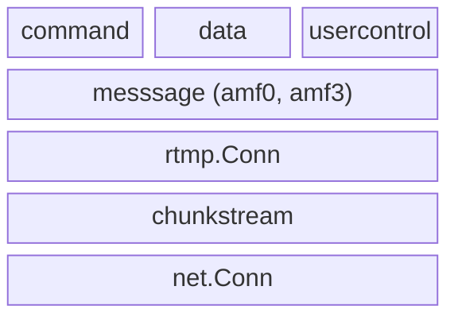

# rtmp-go

Go implementation of Enhanced RTMP, focused on maintaining low-level access to fundamental RTMP message structures

# Examples

Three trivial example programs are provided:

- **server** — An RTMP server that accepts connections on port 1935. When a client sends a publish command, the server logs the received media. When a client sends a play command, the server streams blank video and silent audio.
- **client-publish** — An RTMP client that connects to a server, publishes a stream, and sends blank media to a server.
- **client-play** — An RTMP client that connects to a server, sends a play command, and logs received media.

## Building

```sh
go build ./examples/server/
go build ./examples/client-publish/
go build ./examples/client-play/
```

## Usage

Each example can be paired with ffmpeg/ffplay or with the other examples. The examples listen on or connect to `localhost:1935`.

### Publishing to the server

The server logs media it receives from a publishing client.

#### With ffmpeg as the publish client

```sh
# Terminal 1: Start the RTMP server
./server

# Terminal 2: Publish a test stream to the server
ffmpeg -re -f lavfi -i testsrc=duration=60:size=1280x720:rate=30 \
  -f lavfi -i "sine=frequency=1000:duration=60" \
  -shortest -f flv rtmp://localhost/live
```

#### With client-publish as the publish client

```sh
# Terminal 1: Start the RTMP server
./server

# Terminal 2: Publish blank media to the server
./client-publish
```

### Playing from the server

The server sends blank video and silent audio to a playing client.

#### With ffplay as the play client

```sh
# Terminal 1: Start the RTMP server
./server

# Terminal 2: Play the stream from the server
ffplay rtmp://localhost/live
```

#### With client-play as the play client

```sh
# Terminal 1: Start the RTMP server
./server

# Terminal 2: Play the stream
./client-play
```

### Client-publish with ffplay as the server

Use ffplay in listen mode as a simple RTMP server, then publish to it:

```sh
# Terminal 1: Start ffplay as a listening RTMP server
ffplay -listen 1 rtmp://localhost/live

# Terminal 2: Publish blank media to ffplay
./client-publish
```

### Client-play with ffmpeg as the server

Use ffmpeg in listen mode as a simple RTMP server that generates test media, then play from it:

```sh
# Terminal 1: Start ffmpeg as a listening RTMP server with test content
ffmpeg -re -f lavfi -i "testsrc=duration=60:size=1280x720:rate=30" \
  -f lavfi -i "sine=frequency=1000:duration=60" \
  -shortest -f flv -listen 1 rtmp://localhost/live

# Terminal 2: Play the stream
./client-play
```

# Components



## command

Typed wrappers for RTMP command messages. Each command (Connect, Play, Publish, etc.) is a struct that can be converted to and from generic `message.Command` values.

- `command.Command` — Interface for all typed commands: `CommandName()`, `FromMessageCommand()`, `ToMessageCommand()`
- `command.FromMessageCommand()` — Dispatches a `message.Command` to the appropriate typed command
- `command.RegisterCommand()` — Registers custom command types
- Concrete commands: `Connect`, `Play`, `Publish`, `CreateStream`, `DeleteStream`, `Seek`, `Pause`, `OnStatus`, `ReleaseStream`, `FcPublish`, `FcUnpublish`, `Play2`, `ReceiveAudio`, `ReceiveVideo`, `GetStreamLength`

## data

Typed wrappers for RTMP data messages. Follows the same registry pattern as `command`.

- `data.Handler` — Interface for all typed data handlers: `HandlerName()`, `FromDataMessage()`, `ToDataMessage()`
- `data.FromDataMessage()` — Dispatches a `message.Data` to the appropriate typed handler (automatically unwraps `@setDataFrame`)
- `data.RegisterHandler()` — Registers custom handler types
- Concrete handler: `OnMetaData`

## usercontrol

Typed wrappers for RTMP user control events. Follows the same registry pattern as `command` and `data`.

- `usercontrol.Event` — Interface for all typed events: `EventType()`, `FromMessage()`, `ToMessage()`
- `usercontrol.FromMessage()` — Dispatches a `*message.UserControlMessage` to the appropriate typed event
- `usercontrol.RegisterEvent()` — Registers custom event types
- Concrete events: `StreamBegin`, `StreamEof`, `StreamDry`, `SetBufferLength`, `StreamIsRecorded`, `PingRequest`, `PingResponse`

## message

Defines the core RTMP message abstraction and all concrete message types. Makes use of the AMF encoding packages (`amf0` and `amf3`).

- `message.Message` — Interface implemented by all message types: `Type()`, `Marshal()`, `Unmarshal()`, `Metadata()`
- `message.Command` — Extended interface for command messages: `GetCommand()`, `GetTransactionId()`, `GetObject()`, `GetParameters()`
- `message.Data` — Extended interface for data messages: `GetHandler()`, `GetParameters()`
- `message.Context` — Manages message serialization and AMF3 state; created via `message.NewContext()`
- `message.RegisterType()` — Registers custom message types
- Concrete types: `AudioMessage`, `VideoMessage`, `SetChunkSize`, `Acknowledgement`, `WindowAcknowledgementSize`, `SetPeerBandwidth`, `UserControlMessage`, and AMF0/AMF3 variants of command, data, and shared object messages

### amf0

AMF0 (Action Message Format version 0) encoding and decoding.

- `amf0.Read()` — Reads a single AMF0 value from an `io.Reader`
- `amf0.Write()` — Writes a value to an `io.Writer`, automatically converting Go primitives
- `amf0.Value` / `amf0.MutableValue` — Interfaces for serializable and deserializable AMF0 values
- `amf0.RegisterType()` — Registers custom AMF0 types
- Concrete types: `Number`, `Boolean`, `String`, `LongString`, `Object`, `EcmaArray`, `StrictArray`, `Date`, `Null`, `Undefined`, `Reference`, `XmlDocument`, `TypedObject`, `AvmplusObject`

### amf3

AMF3 (Action Message Format version 3) encoding and decoding. Unlike `amf0`, AMF3 uses stateful readers and writers that maintain reference tables for string and object deduplication.

- `amf3.Reader` — Stateful deserializer: `NewReader()`, `ReadValue()`
- `amf3.Writer` — Stateful serializer: `NewWriter()`, `WriteValue()`
- `amf3.Value` / `amf3.MutableValue` — Interfaces for serializable and deserializable AMF3 values
- `amf3.RegisterType()` — Registers custom AMF3 types
- Concrete types: `Integer`, `Double`, `String`, `Array`, `Object`, `ByteArray`, `Date`, `Xml`, `XmlDocument`, `Boolean`, `Null`, `Undefined`

## rtmp.Conn

The main entry point for RTMP connections. Wraps a `net.Conn` with RTMP handshaking, message framing, and prioritized chunk stream multiplexing.

- `rtmp.Conn` — Interface extending `net.Conn` with `ReadMessage()`, `WriteMessage()`, and `CreateOutboundChunkstream()`
- `rtmp.NewClientConn()` — Creates a client-side connection (performs client handshake)
- `rtmp.NewServerConn()` — Creates a server-side connection (performs server handshake)
- `rtmp.HighPriority`, `rtmp.MediumPriority`, `rtmp.LowPriority` — Priority constants for outbound chunk streams

## chunkstream

Handles RTMP's chunk-based message framing. Messages are split into fixed-size chunks for interleaved multiplexing over a single TCP connection, with progressively compressed headers.

- `chunkstream.Inbound` — Reassembles incoming chunks into complete messages: `NewInboundChunkStream()`, `Read()`
- `chunkstream.Outbound` — Fragments outbound messages into chunks: `NewOutboundChunkStream()`, `Marshal()`
- `chunkstream.ChunkHeader` — Chunk protocol header with `Read()` and `Write()` methods
- `chunkstream.HeaderType` — Four header compression levels: `HeaderTypeFull`, `HeaderTypeSameStream`, `HeaderTypeSameStreamAndLength`, `HeaderTypeContinuation`

# Implementation Status

## RTMP v1.0

| Spec Feature | Status |
|---|---|
| **§5.2 Handshake** | **Complete** — C0/S0, C1/S1, C2/S2 sequence for both client and server; version 3 negotiation |
| **§5.3.1.1 Chunk Basic Header** | **Complete** — 1-byte (ID 2–63), 2-byte (ID 64–319), and 3-byte (ID 64–65599) formats |
| **§5.3.1.2 Chunk Message Header** | **Complete** — All four types: Type 0 (full), Type 1 (same stream), Type 2 (same stream and length), Type 3 (continuation) |
| **§5.3.1.3 Extended Timestamp** | **Complete** — 4-byte extended timestamp for values ≥ 0xFFFFFF; properly handled on continuation chunks |
| **§5.4.1 Set Chunk Size (type 1)** | **Complete** — Chunk size range 1–16777215; high bit masked per spec |
| **§5.4.2 Abort Message (type 2)** | **Complete** — Discards partially received message on indicated chunk stream |
| **§5.4.3 Acknowledgement (type 3)** | **Complete** — Sequence number tracking for received bytes |
| **§5.4.4 Window Acknowledgement Size (type 5)** | **Complete** — Server-to-client bandwidth window size |
| **§5.4.5 Set Peer Bandwidth (type 6)** | **Complete** — Window size with limit types: Hard, Soft, Dynamic |
| **§6.2 User Control Messages (type 4)** | **Complete** — StreamBegin, StreamEOF, StreamDry, SetBufferLength, StreamIsRecorded, PingRequest, PingResponse |
| **§7.1.1 Command Message (types 20/17)** | **Complete** — AMF 0 (type 20) and AMF 3 (type 17) command messages with command name, transaction ID, command object, and parameters |
| **§7.1.2 Data Message (types 18/15)** | **Complete** — AMF 0 (type 18) and AMF 3 (type 15) data messages with handler name and parameters |
| **§7.1.3 Shared Object Message (types 19/16)** | **Complete** — AMF 0 (type 19) and AMF 3 (type 16) with all 11 event types |
| **§7.1.4 Audio Message (type 8)** | **Complete** — Legacy codec IDs, sample rates, sample sizes, AAC packet types |
| **§7.1.5 Video Message (type 9)** | **Complete** — Frame types (keyframe, inter, disposable, generated), codec IDs, packet types, composition time offset |
| **§7.1.6 Aggregate Message (type 22)** | **Not Implemented** — Message type defined but not yet handled |
| **§7.2.1.1 connect** | **Complete** — All Command Object properties: app, flashVer, swfUrl, tcUrl, fpad, audioCodecs, videoCodecs, videoFunction, pageUrl, objectEncoding |
| **§7.2.1.2 call** | **N/A** — Per Errata §8.2, `call` is a client-side API method, not a wire-level command; library supports arbitrary command names via the generic RPC mechanism |
| **§7.2.1.3 createStream** | **Complete** — Transaction ID and stream ID allocation |
| **§7.2.2.1 play** | **Complete** — Stream name, start position (−2/−1/≥0), duration, and reset flag |
| **§7.2.2.2 play2** | **Complete** — NetStreamPlayOptions with streamName, oldStreamName, start, duration, offset, transition |
| **§7.2.2.3 deleteStream** | **Complete** — Stream ID parameter; sent on Message Stream ID 0 per Errata §8.3 |
| **§7.2.2.4 receiveAudio** | **Complete** — Boolean flag to enable/disable audio |
| **§7.2.2.5 receiveVideo** | **Complete** — Boolean flag to enable/disable video |
| **§7.2.2.6 publish** | **Complete** — Publishing name and type (live, record, append, appendWithGap) |
| **§7.2.2.7 seek** | **Complete** — Seek position in milliseconds |
| **§7.2.2.8 pause** | **Complete** — Pause/unpause flag with timestamp in milliseconds |
| **onStatus responses** | **Complete** — 25+ status codes including NetStream.Play.Start, NetStream.Publish.Start, NetConnection.Connect.Success, and others |
| **Non-standard commands** | **Complete** — FCPublish, FCUnpublish, releaseStream, getStreamLength for common encoder compatibility |

## RTMP Errata

| Errata Item | Status |
|---|---|
| **§3 Handshake Echo Validation** | **Correct** — C2/S2 echo not strictly validated; proprietary extensions (e.g. RTMPE) may modify random bytes for key exchange or feature enablement |
| **§4.1 Chunk Basic Header Byte Order** | **Correct** — 3-byte chunk stream ID correctly encoded/decoded as little-endian |
| **§4.2 Message Stream ID Byte Order** | **Correct** — Message stream ID correctly encoded/decoded as little-endian uint32 in Type 0 Chunk Message Headers |
| **§5.1 Extended Timestamp in Type 3 Chunks** | **Correct** — Extended timestamp field consumed on every Type 3 continuation chunk when prior header indicated extended timestamps |
| **§5.2 Timestamp Ordering** | **N/A** — Advisory guidance; no timestamp ordering validation required |
| **§6 Abandoning a Message** | **Correct** — Abort message discards partial message data while preserving chunk stream timestamp state for subsequent messages |
| **§7 RTMP Message Format Constraints** | **Partial** — Chunk size validated (1–16777215); message stream ID and payload length limits not explicitly enforced |
| **§7.1 Alternative Transports** | **N/A** — Informational; memorializes that RTMP messages can be carried over transports other than RTMP Chunk Stream |
| **§7.2 Object Encoding 3** | **Correct** — Type 17 and Type 15 messages use format selector byte `0x00` with AMF 0 default encoding and `avmplus-object-marker` (`0x11`) prefix for AMF 3 values |
| **§8.1.1 objectEncoding Negotiation** | **Correct** — `MakeResponse` echoes negotiated encoding level; application controls mutual negotiation logic |
| **§8.1.2 tcUrl** | **N/A** — Library stores and round-trips `tcUrl`; URI validation and `userinfo`/`fragment` stripping are application responsibilities |
| **§8.1.3 app** | **N/A** — Library stores and round-trips `app`; interpretation is implementation-specific per the errata |
| **§8.1.4 Codec Negotiation** | **Correct** — `audioCodecs` and `videoCodecs` bitmask fields fully supported in `connect` Command Object |
| **§8.1.5 Optional User Arguments** | **Correct** — Zero or more additional arguments of any AMF type supported after the Command Object |
| **§8.1.6 Authentication** | **N/A** — Informational; describes possible authentication patterns using existing RTMP facilities |
| **§8.2 call** | **N/A** — Clarification that `call` is a client-side API method, not a standard command name; library supports arbitrary command names |
| **§8.3 deleteStream** | **Correct** — Correctly identified as a NetConnection command sent on Message Stream ID 0 |

## Enhanced RTMP V2

| E-RTMP Feature | Status |
|---|---|
| **Enhanced Audio: ExAudioTagHeader** | **Complete** — SoundFormat==9 triggers E-RTMP path; all `AudioPacketType` enums (SequenceStart, CodedFrames, SequenceEnd, MultichannelConfig, Multitrack, ModEx) handled |
| **Enhanced Audio: FourCC codecs** | **Complete** — AC-3, E-AC-3, Opus, MP3, FLAC, AAC all defined with correct FourCC values |
| **Enhanced Audio: Multitrack** | **Complete** — `AvMultitrackType` (OneTrack, ManyTracks, ManyTracksManyCodecs) with per-track parsing/marshaling |
| **Enhanced Audio: ModEx / TimestampNanoOffset** | **Complete** — ModEx loop with variable-length data; nano offset extracted from 3-byte UI24 |
| **Enhanced Audio: MultichannelConfig** | **Complete** — `AudioChannelOrder` (Unspecified/Native/Custom), channelCount, channel mapping, channel flags all parsed |
| **Enhanced Video: ExVideoTagHeader** | **Complete** — `isExVideoHeader` flag detection; all `VideoPacketType` enums (SequenceStart, CodedFrames, SequenceEnd, CodedFramesX, Metadata, MPEG2TSSequenceStart, Multitrack, ModEx) |
| **Enhanced Video: FourCC codecs** | **Complete** — VP8, VP9, AV1, AVC, HEVC, VVC all defined |
| **Enhanced Video: Multitrack** | **Complete** — same `AvMultitrackType` enum; per-track FOURCC + trackId + sizeOfVideoTrack parsing |
| **Enhanced Video: ModEx / TimestampNanoOffset** | **Complete** — mirrors audio ModEx loop |
| **Enhanced Video: Metadata (colorInfo/HDR)** | **Complete** — `VideoMetadata` struct with `ColorInfo` (colorConfig, hdrCll, hdrMdcv); AMF round-trip with tests |
| **Enhanced Video: CodedFramesX** | **Complete** — compositionTimeOffset implicitly zero |
| **Enhanced Video: VideoCommand** | **Complete** — StartSeek/EndSeek handled for both legacy and E-RTMP paths |
| **Reconnect Request** | **Complete** — `NetConnectionConnectReconnectRequest` status code defined with description and test |
| **Connect: fourCcList** | **Complete** — `[]string` field with `amf:"fourCcList,omitempty"` |
| **Connect: videoFourCcInfoMap / audioFourCcInfoMap** | **Complete** — custom `FourCcInfoMap` type with manual Get/Set for AMF; included in `MakeResponse` |
| **Connect: capsEx** | **Complete** — `CapsExMask` with Reconnect=0x01, Multitrack=0x02, ModEx=0x04, TimestampNanoOffset=0x08 |
| **Connect: FourCcInfoMask** | **Complete** — CanDecode=0x01, CanEncode=0x02, CanForward=0x04 |
| **Connect: videoFunction flags** | **Complete** — Seek=0x0001, HDR=0x0002, VideoPacketTypeMetadata=0x0004, LargeScaleTile=0x0008 |
| **onMetaData: FourCC codec IDs** | **Complete** — `AudioCodecId`/`VideoCodecId` fields accept both legacy and FourCC values |
| **onMetaData: trackIdInfoMap** | **Complete** — `AudioTrackIdInfoMap` and `VideoTrackIdInfoMap` with `map[int]TrackInfo` and AMF read/write |
| **AMF3 format selector byte** | **Complete** — Type 17/15 messages use format 0 with `0x11` prefix per AMF3 value |
| **Protocol Versioning** | **Complete** — No version bump, self-describing; handshake stays at version 3 |
